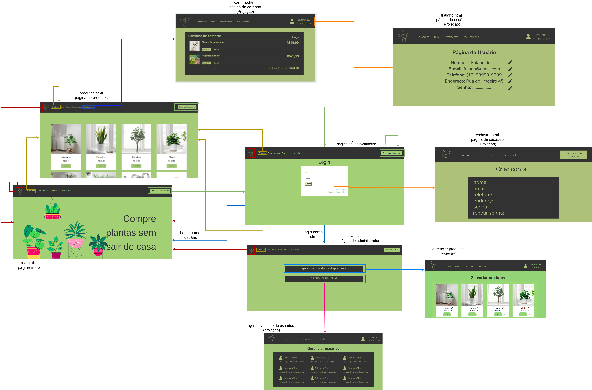

#  SCC0219 - Web Development
## Online Shop - Plants and Gardening Tools
Online shop website, that contains products for gardening, like plants, soil, vases and tools. The application suports two types of users: admin (to manage products, promotions and other users) and clients (that can buy products and add their favorite to cart).  
The specific application for this kind business is the possibility to teach the user how to take care of the plant they intend to buy, like a little manual.

## Group:
* Ana Laura Chioca Vieira - 9866531
* Maria Fernando Lucio de Mello - 11320860
* Paulo Matana - 10892676

## Requirements:
* The system must have 2 types of users: Clients and Administrators.
  * Administrators are responsible for registering/managing administrators, customers, and products/services provided. The application already comes with an account admin with password admin. Admins are a special kind of user.
  * Customers are users who access the system to buy products/services.
* The admin record includes: name, id, phone, email and password.
* Each customer's record includes: name, id, address, phone, email and password.
* Product/services records includes: name, id, photo, description, price, size, quantity (in stock), quantity sold.
* Selling Products: Products are selected, their quantity chosen, and are included in a cart. Products are purchased using a credit card number (any number is accepted by the system). The quantity of product sold is subtracted from the quantity in stock and added to the quantity sold. Carts are emptied only on payment or by customers.
* Product Management: Administrators can create/update/read/delete new products and services.
* Your functionality: In this website, for all plants in the sales catalog, there will be a small manual on how to take care of it.
* The system must provide accessibility requirements and provide good usability. The system must be responsive.

## Project Description:

The following diagram shows how our website works:

#### Navbar
The navbar appears in every page of our application, and was made using Bootstrap's navbar component. A specific stylesheet was used to apply different colors to the navbar. 

#### Admin Page
This page (admin.html) is shown when the administrator is logged in and now he can access new functionalities.
This user can manage the available products, manage the current promotions and manage the users (clientes) that are cadastrated on the plataform. He can remove them and see their buying history.
There he can normally access all the other pages, but, of course, has some of the privilegies told before.

#### Admin Users Page
In this page the administrator can make other users admins as well. 

#### Login Page
In this page the user can login the website's system using a registerd email and password. After connected the user will be redirected to the main page, if logged with a client account, or to admin page if logged with an admin account. 
If the user doesn't have a registerd account, from this page he can access the register page.

#### Products Page
This page shows all the products available in our online shop. If the client clicks the "produtos" button in the navbar, they are redirected to this page. If they click another button, such as "acessórios" or "terra", they will be redirected to the same products page, but a filter is applied. The products page was built using Bootstrap's cards and grid system.

#### Main Page
The main page is responsive, and the background image changes according to the size of the screen.

#### Other pages
Some other pages will be made for this project, such as the cart page, which will list all the products chosen by the user, the user page, in which the user will be able to change it's infos (name, password, etc), and the admin page, in which the admin of the website can manage the products and users.
 
## Comments About the Code:

In this project, CSS3, HTML5, Bootstrap, JavaScript and Python (for the server) were used.

## Test Plan:

Our tests were made manually. 

## Test Results:

We performed multiples tests for each funcionality of our system. To test the functionalities it was necessary to use some type of database, in this project we used the local storage as a fake database, this way we could save Product and User objects and simulate a database API call inside the functionalities javascript code. 

* Login systems is working well for all types of users. After loging in user is redirected to the correspondent page depending on it's type (admin or client). 
* Registration page is working well. After registering the user's informations are saves in local storage and the user is redirected to the login page.
* Administrator pages are working well. 
  * The administrator can make other users in the local storage administrators. One administrator can not remove another administrator's role, but only their own.
  * The administrator can add new products or edit the ones already in local storage. Both actions are working well and the product infos are being saved in local storage correctly.
* Clients can add products to the cart only once, and can change the desired quantity in the cart page. Once a product is already inside the cart, it cannot be added again, but only removed or have it's quantity changed.
* The cart is interactive and displays the current sum of all the products in the shopping cart.

## Build Procedure:

Run `python3 server.py` in the same directory as the project's folders are.  
Type `http://localhost:8080/` on your browser to access our main page.

## Problemms:
 We had some problems to implemet a single navbar html file and use it in all the other pages, and now (2nd milestone) we are able to do this by using javascipt. 

## Comments:
