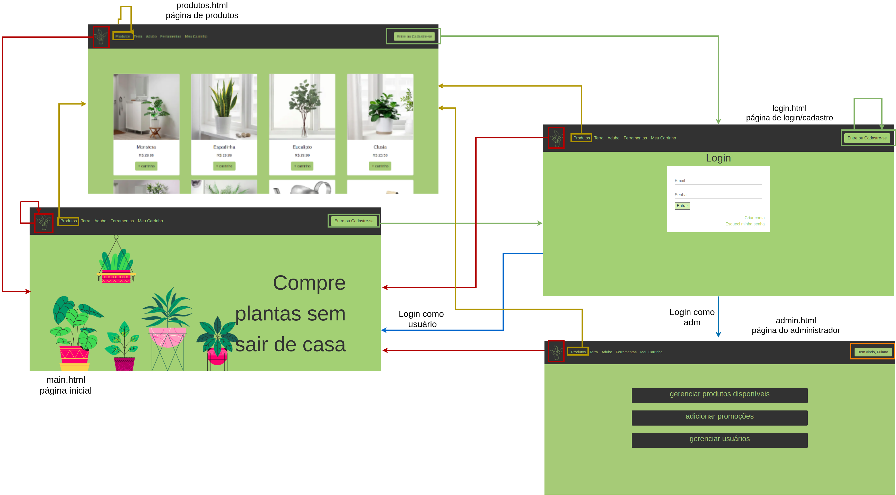

#  SCC0219 - Web Development
## Online Shop - Plants and Gardening Tools
Online shop website, that contains products for gardening, like plants, soil, vases and tools. The application suports two types of users: admin (to manage products, promotions and other users) and clients (that can buy products and add their favorite to cart).  
The specific application for this kind business is the possibility to teach the user how to take care of the plant they intend to buy, like a little manual.

## Group:
* Ana Laura Chioca Vieira - 9866531
* Maria Fernando Lucio de Mello - 11320860
* Paulo Matana - 10892676

## Requirements:
* The system must have 2 types of users: Clients and Administrators.
  * Administrators are responsible for registering/managing administrators, customers, and products/services provided. The application already comes with an account admin with password admin.
  * Customers are users who access the system to buy products/services.

* The admin record includes, at least: name, id, phone, email.
* Each customer's record includes, at least: name, id, address, phone, email.
* Product/services records include, at least: name, id, photo, description, price, quantity (in stock), quantity sold.
* Your store may sell products, services or both (you decide).
* Selling Products (or services): Products are selected, their quantity chosen, and are included in a cart. Products are purchased using a credit card number (any number is accepted by the system). The quantity of product sold is subtracted from the quantity in stock and added to the quantity sold. Carts are emptied only on payment or by customers.
* Product/Service Management: Administrators can create/update/read/delete (crud) new products and services. For example, they can change the stock quantity.
* Your functionality: In this website, for all plants in the sales catalog, there will be a little manual on how to take care of it.
* The system must provide accessibility requirements and provide good usability. The system must be responsive.

## Project Description:

#### Admin Page
This page (admin.html) is shown when the administrator is logged in and now he can access new functionalities.  
This user can manage the available products, manage the current promotions and manage the users (clientes) that are cadastrated on the plataform.  
There he can normally access all the other pages, but, of course, has some of the privilegies told before.

## Comments About the Code:

In this project, CSS3, HTML5 and Bootstrap were used.

## Test Plan:

## Test Results:

## Build Procedure:

## Problemms:
  We had some problems to implemet a single navbar html file and use it in all the other pages. For now we have created one navbar code for each page.

## Comments:
