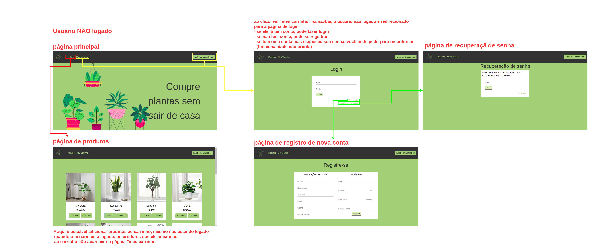

#  SCC0219 - Web Development
## Online Shop - Plants and Gardening Tools
Online shop website, that contains products for gardening, like plants, soil, vases and tools. The application suports two types of users: admin (to manage products, promotions and other users) and clients (that can buy products and add their favorite to cart).  
The specific application for this kind business is the possibility to teach the user how to take care of the plant they intend to buy, like a little manual.

## Group:
* Ana Laura Chioca Vieira - 9866531
* Maria Fernando Lucio de Mello - 11320860
* Paulo Matana - 10892676

## Requirements:
* The system must have 2 types of users: Clients and Administrators.
  * Administrators are responsible for registering/managing administrators, customers, and products/services provided. The application already comes with an account admin with password admin. Admins are a special kind of user.
  * Customers are users who access the system to buy products/services.
* The admin record includes: name, id, phone, email and password.
* Each customer's record includes: name, id, address, phone, email and password.
* Product/services records includes: name, id, photo, description, price, size, quantity (in stock), quantity sold.
* Selling Products: Products are selected, their quantity chosen, and are included in a cart. Products are purchased using a credit card number (any number is accepted by the system). The quantity of product sold is subtracted from the quantity in stock and added to the quantity sold. Carts are emptied only on payment or by customers.
* Product Management: Administrators can create/update/read/delete new products and services.
* Your functionality: In this website, for all plants in the sales catalog, there will be a small manual on how to take care of it.
* The system must provide accessibility requirements and provide good usability. The system must be responsive.

## Project Description:

The following diagram shows how our website works:

Logged user:

Unlogged user:

Administrator user:

#### Navbar
The navbar appears in every page of our application, and was made using Bootstrap's navbar component. A specific stylesheet was used to apply different colors to the navbar. We load the navbar onto each page using javascript. The navbar is presented in a different manner depending on the type of the user (administrator, client or unlogged).

#### Admin Page (and subsequent pages)
This page is shown in the navbar when the administrator is logged in.
In this page the admin can manage the available products or the users that are registered on the plataform. He can turn a normal user (client) into a new administrator. He could also add new products or edit the already existing ones.
Login: admin@admin.com
Password: 321321

#### Login Page
In this page the user can login the website's system using a registerd email and password. After connected the user will be redirected to the main page, if logged with a client account, or to admin page if logged with an admin account. 
If the user doesn't have a registered account, he can access the register page from this page.

#### Products Page
This page shows all the products available in our online shop. The product cards are loaded in this page using javascript. All products are saved in local storage, and we load each of them separately. This way, if an administrator adds a new product or edits an already existing one, the products page will be automatically updated.
This page also presents our group's functionality. For every product that belongs to the category "plant", there will be a button "cuidados" which opens a modal with instructions on how to care for your plant.

#### Cart and Payments Page
This page displays all the products selected by the user. It's possible to change the desired quantity of each product, as well as remove them. The sidebar display the current cost of all products in the cart and the shipment options. After the user is done with shopping, they can go to the payment page, where they'll fill in the forms with shipment and payment information. After the payment is concluded, the user is redirected to the main page. 

#### Main Page
The main page is responsive, and the background image changes according to the size of the screen.
 
## Comments About the Code:

In this project, CSS3, HTML5, Bootstrap, JavaScript and Python (for the server) were used.

## Test Plan:

Our tests were made manually. 

## Test Results:

We performed multiples tests for each funcionality of our system. To test the functionalities it was necessary to use some type of database, in this project we used the local storage as a fake database, this way we could save Product and User objects and simulate a database API call inside the functionalities javascript code. 

* Some JavaScipt codes were made to automatically create fake database and load users and products into it. These scripts run when the user accesses the main page so if you run this version in your machine, it's important to open first the main page to guarantee that the fake database functionalities run correctly.
* Login systems is working well for all types of users. After loging in user is redirected to the correspondent page depending on it's type (admin or client).
* Users can loggout from their account. 
* Registration page is working well. After registering the user's informations are saves in local storage and the user is redirected to the login page.
* Administrator pages are working well. 
  * The administrator can make other users in the local storage administrators. One administrator can not remove another administrator's role, but only their own. Everything is working as expected.
  * The administrator can add new products or edit the ones already in local storage. Both actions are working well and the product infos are being saved in local storage correctly.
* Clients can add products to the cart only once, and can change the desired quantity in the cart page. Once a product is already inside the cart, it cannot be added again, but only removed or have it's quantity changed.
* The cart is interactive and displays the current sum of all the products in the shopping cart.

## Build Procedure:

Run `python3 server.py` in the same directory as the project's folders are.  
Type `http://localhost:8080/` on your browser to access our main page.

**Important:** Do not access the website pages without loading the main page first. The main page contains important javascript code that loads the fake database that is used in the rest of the website. In the final version of this project we will use a real database so this problem will no longer exist.  If you follow the instructions above the first page loded will be the main, and the site will run correctly.

## Problems:
 We had some problems to implement a single navbar html file and use it in all the other pages, and now (2nd milestone) we are able to do this by using javascipt.

## Comments:
